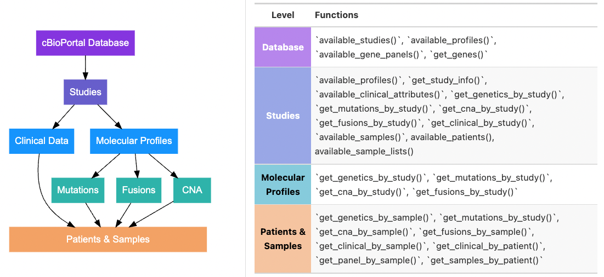

<!-- README.md is generated from README.Rmd. Please edit that file -->

  
```{r, include = FALSE}
knitr::opts_chunk$set(
  collapse = TRUE,
  comment = "#>",
  fig.path = "man/figures/README-",
  out.width = "100%"
)

library(tidyverse)
```

<!-- badges: start -->
[](https://github.com/karissawhiting/cbioportalR/actions)
[](https://app.codecov.io/gh/karissawhiting/cbioportalR?branch=master)

<!-- badges: end -->

# cbioportalR <a href='https://karissawhiting.github.io/cbioportalR/'></a>

{cbioportalR} allows you to access [cBioPortal's](https://www.cbioportal.org/) genomic and clinical data sets directly through R. The package wraps cBioPortal's API endpoints so R users can easily leverage the [existing API](https://www.cbioportal.org/api/swagger-ui.html) to access genomic data on mutations, copy number alterations and fusions as well as data on tumor mutational burden (TMB), microsatellite instability status (MSI) and select clinical data points (depending on the study). 

This package was created to work with both the public [cBioPortal website](https://www.cbioportal.org/), as well as private institutional cBioPortal instances (e.g. MSKCC, GENIE) with appropriate credentials and [authentication].

For more information on cBioPortal, see the following publications:

- [Gao et al. Sci. Signal. 2013](https://pubmed.ncbi.nlm.nih.gov/23550210/)
- [ Cerami et al. Cancer Discov. 2012](https://aacrjournals.org/cancerdiscovery/article/2/5/401/3246/The-cBio-Cancer-Genomics-Portal-An-Open-Platform)

For full documentation on the cBioPortal API, please see the following links:

- [cBioPortal API and API Clients documentation](https://docs.cbioportal.org/web-api-and-clients/)
- [Full reference documentation for API](https://www.cbioportal.org/api/swagger-ui.html#/)

*Note: If you are a MSK researcher working on IMPACT data, you should connect to MSK's cBioPortal instance to get the most up to date IMPACT data, and you must follow the MSK-IMPACT publication guidelines when using this data*

## Installation

You can install {cbioportalR} with:

```{r,eval=F}
remotes::install_github("karissawhiting/cbioportalR")
```

```{r}
library(cbioportalR)
```

## Authentication {#authentication}

If you are using the public domain https://www.cbioportal.org/, you don't need a token to start pulling data. If you are using a private instance of cBioPortal (like MSKCC's institutional database), you will need to acquire a token and save it to your `.Renviron` file (or wherever you store credentials). Simply log in to your institution's cBioPortal site, acquire a token (Usually through the 'Web API' tab) and save it in your `.Renviron` file. This will save the token as an environmental variable so you don't have to hard code the secret key in your scripts. 

*Tip: The following {usethis} function can easily find and open the `.Renviron` for you:*

```{r,eval=F}
usethis::edit_r_environ()
```

Paste the token you were given (using the format below) in the .Renviron file and save the file changes. *After saving you should restart your R session to ensure the token is saved and recognized.*

```{r, eval=F}
CBIOPORTAL_TOKEN = 'YOUR_TOKEN'
```

You can test that your token was saved using:

```{r,eval = F}
get_cbioportal_token()
```

For every new R session, you need to set your database URL. The `set_cbioportal_db()` function will set an environmental variable for your session that tells the package which database to point to for all API calls. You can set it to point to the public database with `db = 'www.cbioportal.org'` or `db = 'public'`. If using a private database you will pass your institutions cBioPortal URL as `db`. This function will both set your URL and check the connection. 

```{r}
set_cbioportal_db(db = "public")
```

You are now set up for the remainder of your session! API calls depend on your internet connection and possibly a VPN connection so you can use the following to check your connection at any time throughout your session:

```{r}
test_cbioportal_db()
```


## cBioPortal Data Model

There are many ways to identify and pull data (e.g. by study ID, by sample ID, by molecular profile ID). Having an understanding of how data is organized in cBioPortal will help you determine which functions you need. The figure below outlines the general data schema for cBioPortal and which functions access which levels of the schema:

```{r, results = FALSE, echo=FALSE, eval = FALSE }

x <- tibble::tibble(
  level = c("Database", "Studies", "Molecular Profiles", "Patients & Samples"),
  functions = list(
    c("`available_studies()`",
      "`available_profiles()`",
      "`available_gene_panels()`", 
      "`get_genes()`"),
    
    c("`available_profiles()`", 
      "`get_study_info()`",
      "`available_clinical_attributes()`",
      "`get_genetics_by_study()`",
      "`get_mutations_by_study()`",
      "`get_cna_by_study()`", 
      "`get_fusions_by_study()`", 
      "`get_clinical_by_study()`", 
      "`available_samples()`", 
      "available_patients()"),
    
    c("`get_genetics_by_study()`",
      "`get_mutations_by_study()`",
      "`get_cna_by_study()`",
      "`get_fusions_by_study()`"), 
    
    c("`get_genetics_by_sample()`",
      "`get_mutations_by_study()`",
      "`get_cna_by_sample()`",
      "`get_fusions_by_sample()`", 
      "`get_clinical_by_sample()`", 
      "`get_clinical_by_patient()`", 
      "`get_panel_by_sample()`", 
      "`get_samples_by_patient()`"))) %>%
  mutate(level = 
           forcats::fct_relevel(level, "Database", "Studies", 
                                "Molecular Profiles", "Patients & Samples"))

table_funs <- x %>%
  gt::gt() %>%
  gt::cols_label(level = gt::md("**Level**"),
             functions = gt::md("**Functions**")) %>%
  gt::tab_options(table.font.size = 'small') %>%
  gt::data_color(
    columns = level,
    colors = scales::col_factor(
      palette = c("BlueViolet", "SlateBlue", "DodgerBlue", "LightSeaGreen", "SandyBrown"),
      domain = NULL,
#      reverse = TRUE
    ),
    alpha = 0.6
  ) %>%
  gt::cols_align(
    align = "left",
    columns = functions
  ) %>%
  gt::tab_style(
    style = list(
      gt::cell_text(weight = "bold")
      ),
    locations = gt::cells_body(
      columns = level,
      rows = everything()
    )
  ) %>%
  gt::tab_options(table.width = "500px")

raw_html_table <- table_funs %>% 
  gt::as_raw_html()

# <table>
# <tbody>
# 	<tr>
# 		<td></td>
# 		<td>`r raw_html_table`</td>
# 	</tr>
# </tbody>
# </table>
  
```


```{r, echo=FALSE}



```


## Examples

To see available studies in your database you can use:

```{r}
available_studies() %>% 
  head(n = 10)
```
To view study metadata on a particular study you can use:

```{r}
get_study_info("acc_tcga") %>% 
  t()
```

To pull all genomic data for a particular study you can use:

```{r }
# As a result you will get a list of dataframes of 1) mutation + fusion and 2) cna.
df <- get_genetics_by_study(study_id = "acc_tcga")
```

As you can see, there is no fusion data available for this study, only mutations and cna. Alternatively, you can use  `get_mutations_by_study(study_id = "acc_tcga")` and `get_cna_by_study(study_id = "acc_tcga")`

```{r }
df$mut %>% 
  head()
```

You can also pull data by specific sample IDs but the API requires a bit more information from you (unlike pulling by study ID which returns everything available for that study). This can be useful when working within a very large database or working across samples housed in multiple different studies. When querying by `sample_id` you must also specify the corresponding `study_id` in which the samples are housed. When these pieces of information are not provided, {cbioportalR} makes an informed guess based on your connection and will throw an informative message to clarify exactly what is being queried. In the example below, the function defaults to the public version of the IMPACT database (`study_id = "msk_impact_2017"`).

```{r}
samples <- available_samples(study_id = "acc_tcga") %>%
  pull(sampleId) %>%
  head(n = 10)

mutations <- get_mutations_by_sample(sample_id =  samples)

# no results returned because these samples are not in this study
length(mutations) == 0
```

No results were returned because the samples are not stored in this study. When we specify the correct study (`study_id = "acc_tcga"`), we get accurate results. You can check which samples are stored in a study using `available_samples(study_id = "acc_tcga")`. 

```{r}
mutations <- get_mutations_by_sample(sample_id =  samples,
                                    study_id = "acc_tcga")

mutations %>%
  head()
```

Lastly, you can also pull clinical data by study ID, sample ID or patient ID. To see what data is available, you can use:

```{r}
available_clinical_attributes(study_id = "acc_tcga") %>%
  head()
```

```{r}
get_clinical_by_study("acc_tcga")
```

```{r}
get_clinical_by_sample(sample_id = samples, study_id = "acc_tcga") %>%
  head(10)
```

```{r, eval = FALSE}
patients <- available_patients(study_id = "acc_tcga") %>%
  pull(patientId) %>%
  head(n = 10)

get_clinical_by_patient(patient_id = patients, study_id = "acc_tcga", 
                        clinical_attribute = "AGE") %>%
  head(10)
```

All functions that pull by study IDs are limited to pulling data from one study at a time. If you need to pull specific samples from multiple studies, you likely want to pull by sample ID (instead of study ID) and supply the function with a dataframe of `sample_study_pairs` that specify  where the function should look for each study. For more information see the [Overview of Workflow Vignette](https://karissawhiting.github.io/cbioportalR/articles/overview-of-workflow.html). 


## Contributing

Please note that {cbioportalR} is released with a [Contributor
Code of
Conduct](https://karissawhiting.github.io/cbioportalR/CODE_OF_CONDUCT.html). By contributing to this project, you agree to abide by its terms. 

Thank you to contributors!

[&#x0040;arorarshi](https://github.com/arorarshi),
[&#x0040;AxelitoMartin](https://github.com/AxelitoMartin),
[&#x0040;edrill](https://github.com/edrill),
[&#x0040;jalavery](https://github.com/jalavery), 
[&#x0040;ddsjoberg](https://github.com/ddsjoberg)


Thank you [Isaak Liptzin](https://awenfilms.net/) for the hex sticker!
