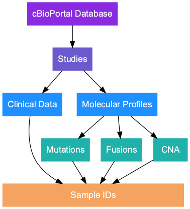

<!-- README.md is generated from README.Rmd. Please edit that file -->
<!-- badges: start -->

[](https://github.com/karissawhiting/cbioportalR/actions)
<!-- badges: end -->

# cbioportalR

{cbioportalR} allows you to access cBioPortal’s genomic and clinical
data directly through R. The package wraps cBioPortal’s existing API
endpoints in R so R users can easily leverage cBioPortal’s API. Using
these functions, you can access genomic data on mutations, copy number
alterations and fusions as well as data on tumor mutational burden
(TMB), microsatellite instability status (MSI) and select clinical data
points (depending on the study).

This package was created to work with both [the public cBioPortal
website](https://www.cbioportal.org/), as well as MSK’s private
institutional cbioportal database. To connect to a private database, you
must first get an access token (or whatever credentials your institution
requires) and supply the specific API url at the beginning of your
session (details below).

For more information on cBioPortal, see the following publications:

-   [Gao et al. Sci. Signal.
    2013](https://pubmed.ncbi.nlm.nih.gov/23550210/)
-   [Cerami et al. Cancer Discov.
    2012](https://cancerdiscovery.aacrjournals.org/content/2/5/401.abstract)

For full documentation on the cBioPortal API, please see the following
links:

-   [cBioPortal API and API Clients
    documentation](https://docs.cbioportal.org/6.-web-api-and-clients/api-and-api-clients)
-   [full reference documentation for
    API](https://www.cbioportal.org/api/swagger-ui.html#/)




## Installation

You can install the development version of {cbioportalR} with:

``` r
remotes::install_github("karissawhiting/cbioportalR")
```

## Setting up the API

If you are using the public domain <https://www.cbioportal.org/>, you do
not need a token to access data. If you are using a private instance of
cbioportal (like MSK’s institutional database), you will need to acquire
a token and save it to your `.Renviron` file (or wherever you store
credentials).

Simply log in to your institution’s cbioportal website, acquire a token
(Usually through the ‘Web API’ tab) and save it in your `.Renviron`
file. This will save the token as an environmental variable so you do
not have to hard code the secret key in your scripts.

*Tip: The following {usethis} function can easily find and open the
`.Renviron` for you:*

``` r
usethis::edit_r_environ()
```

Paste the token you were given (using the format below) in the .Renviron
file and save the file changes. You may want to save and restart your R
session to ensure the token is saved and recognized.

``` r
CBIOPORTAL_TOKEN = 'YOUR_TOKEN'
```

You can test that your token was saved using:

``` r
library(cbioportalR)
get_cbioportal_token()
```

To reiterate, if you are planning to retrieve data using public
cBioPortal, you do not need a token. If you need to access data on an
institutional cBioPortal page you must get a token first.

*Note: If you are a MSK researcher working on IMPACT, you should connect
to MSK’s cBioPortal instance to get the most up to date IMPACT data, and
you must follow MSK-IMPACT publication guidelines when using the data*

## Setting the database

For every new R session, you need to set your database URL. The
`get_cbioportal_db()` function will set an environmental variable for
your session that tells the package which database to point to for all
API calls.

You can set it to point to the public database with this shortcut:

``` r
library(cbioportalR)
set_cbioportal_db("public")
#> ✓ You are successfully connected!
#> ✓ base_url for this R session is now set to "www.cbioportal.org/api"
```

or you can set it to a specific institution database with:

``` r
get_cbioportal_db("<<your institution's url>>/api")
```

## Retrieving data

Once you’ve set your preferred db connection, you can pull data via
study ID or sample ID.

To see available studies (this depends on what cBioPortal database you
are connected to), you can use:

``` r
available_studies() %>% head(n = 10)
#> # A tibble: 10 × 13
#>    studyId name  description publicStudy pmid  citation groups status importDate
#>    <chr>   <chr> <chr>       <lgl>       <chr> <chr>    <chr>   <int> <chr>     
#>  1 prad_m… Pros… "Genome-wi… TRUE        2502… Hierony… "PUBL…      0 2021-04-2…
#>  2 pan_or… Chin… "Landscape… TRUE        <NA>  <NA>     ""          0 2021-09-2…
#>  3 crc_ni… Disp… "Targeted … TRUE        <NA>  <NA>     ""          0 2021-10-2…
#>  4 acc_tc… Adre… "TCGA Adre… TRUE        <NA>  <NA>     "PUBL…      0 2021-10-2…
#>  5 acyc_s… Aden… "Whole exo… TRUE        2377… Stephen… "ACYC…      0 2021-10-2…
#>  6 all_st… Acut… "Whole-gen… TRUE        2777… Zhang e… "PUBL…      0 2021-10-2…
#>  7 all_ph… Pedi… "Whole gen… TRUE        <NA>  <NA>     "NCI-…      0 2021-10-2…
#>  8 all_st… Acut… "Comprehen… TRUE        2573… Anderss… "PUBL…      0 2021-11-0…
#>  9 acbc_m… Aden… "Whole exo… TRUE        2609… Martelo… "ACYC…      0 2021-11-0…
#> 10 acyc_j… Aden… "Whole-gen… TRUE        2686… Rettig … "ACYC…      0 2021-11-0…
#> # … with 4 more variables: allSampleCount <int>, readPermission <lgl>,
#> #   cancerTypeId <chr>, referenceGenome <chr>
```

To pull mutation data for a particular study ID you can use:

``` r
# As a result you will get a list of dataframes of 1) mutation + fusion and 2) cna.
df <- get_genetics_by_study(study_id = "nbl_amc_2012")
#> ℹ Returning all data for the "nbl_amc_2012_mutations" molecular profile in the "nbl_amc_2012" study
#> ! No "cna" data returned. Error:  No molecular profile for `data_type = cna` found in "nbl_amc_2012".  See
#> `available_profiles('nbl_amc_2012')`
#> ! No "fusion" data returned. Error:  No molecular profile for `data_type = fusion` found in "nbl_amc_2012".
#> See `available_profiles('nbl_amc_2012')`

mutations <- df$mut 
df %>% head()
#> $mutation
#> # A tibble: 562 × 28
#>    uniqueSampleKey          uniquePatientKey molecularProfil… sampleId patientId
#>    <chr>                    <chr>            <chr>            <chr>    <chr>    
#>  1 TjA0MVQ6bmJsX2FtY18yMDEy TjA0MTpuYmxfYW1… nbl_amc_2012_mu… N041T    N041     
#>  2 TjA0MVQ6bmJsX2FtY18yMDEy TjA0MTpuYmxfYW1… nbl_amc_2012_mu… N041T    N041     
#>  3 TjA0MVQ6bmJsX2FtY18yMDEy TjA0MTpuYmxfYW1… nbl_amc_2012_mu… N041T    N041     
#>  4 TjA0MVQ6bmJsX2FtY18yMDEy TjA0MTpuYmxfYW1… nbl_amc_2012_mu… N041T    N041     
#>  5 TjA0MVQ6bmJsX2FtY18yMDEy TjA0MTpuYmxfYW1… nbl_amc_2012_mu… N041T    N041     
#>  6 TjA0MVQ6bmJsX2FtY18yMDEy TjA0MTpuYmxfYW1… nbl_amc_2012_mu… N041T    N041     
#>  7 TjA0MVQ6bmJsX2FtY18yMDEy TjA0MTpuYmxfYW1… nbl_amc_2012_mu… N041T    N041     
#>  8 TjA0MVQ6bmJsX2FtY18yMDEy TjA0MTpuYmxfYW1… nbl_amc_2012_mu… N041T    N041     
#>  9 TjA0MVQ6bmJsX2FtY18yMDEy TjA0MTpuYmxfYW1… nbl_amc_2012_mu… N041T    N041     
#> 10 TjA0MVQ6bmJsX2FtY18yMDEy TjA0MTpuYmxfYW1… nbl_amc_2012_mu… N041T    N041     
#> # … with 552 more rows, and 23 more variables: entrezGeneId <int>,
#> #   studyId <chr>, center <chr>, mutationStatus <chr>, validationStatus <chr>,
#> #   startPosition <int>, endPosition <int>, referenceAllele <chr>,
#> #   proteinChange <chr>, mutationType <chr>, functionalImpactScore <chr>,
#> #   fisValue <dbl>, linkXvar <chr>, linkPdb <chr>, linkMsa <chr>,
#> #   ncbiBuild <chr>, variantType <chr>, keyword <chr>, chr <chr>,
#> #   variantAllele <chr>, refseqMrnaId <chr>, proteinPosStart <int>, …
```
